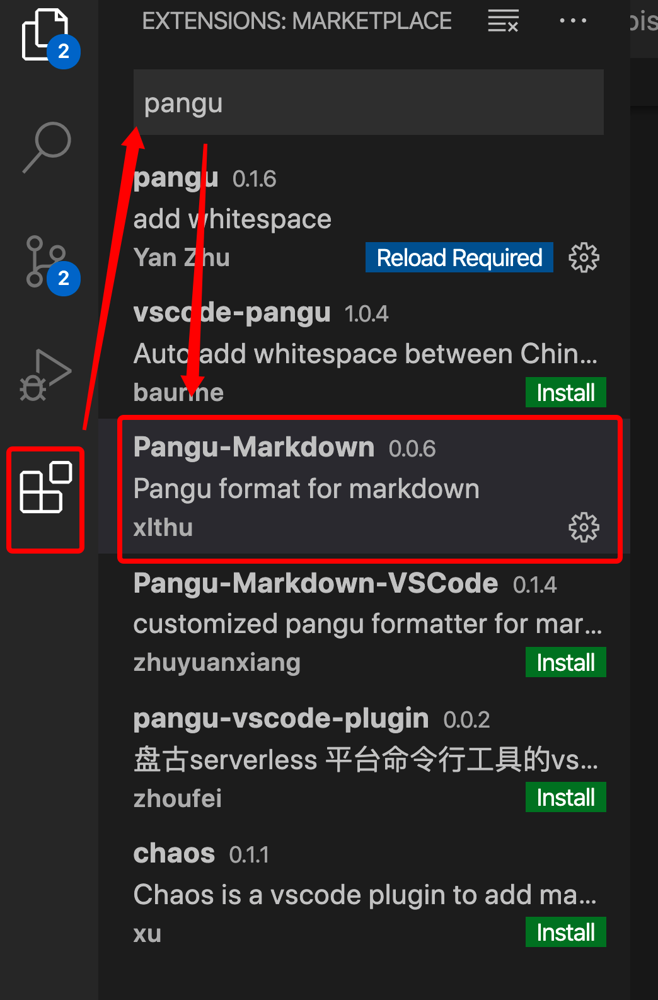
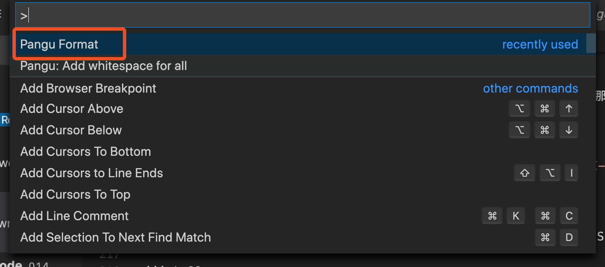

<!--
#
# Licensed to the Apache Software Foundation (ASF) under one or more
# contributor license agreements.  See the NOTICE file distributed with
# this work for additional information regarding copyright ownership.
# The ASF licenses this file to You under the Apache License, Version 2.0
# (the "License"); you may not use this file except in compliance with
# the License.  You may obtain a copy of the License at
#
#     http://www.apache.org/licenses/LICENSE-2.0
#
# Unless required by applicable law or agreed to in writing, software
# distributed under the License is distributed on an "AS IS" BASIS,
# WITHOUT WARRANTIES OR CONDITIONS OF ANY KIND, either express or implied.
# See the License for the specific language governing permissions and
# limitations under the License.
#
-->

# 常见问题

## 为什么要做 API 网关？不是已经有其他的开源网关了吗？

微服务领域对 API 网关有新的需求：更高的灵活性、更高的性能要求，以及云原生的贴合。

## APISIX 和其他的 API 网关有什么不同之处？

APISIX 基于 etcd 来完成配置的保存和同步，而不是 postgres 或者 MySQL 这类关系型数据库。
这样不仅去掉了轮询，让代码更加的简洁，配置同步也更加实时。同时系统也不会存在单点，可用性更高。

另外，APISIX 具备动态路由和插件热加载，特别适合微服务体系下的 API 管理。

## APISIX 的性能怎么样？

APISIX 设计和开发的目标之一，就是业界最高的性能。具体测试数据见这里：[benchmark](https://github.com/apache/incubator-apisix/blob/master/doc/benchmark-cn.md)

APISIX 是当前性能最好的 API 网关，单核 QPS 达到 2.3 万，平均延时仅有 0.6 毫秒。

## APISIX 是否有控制台界面？

是的，在 0.6 版本中我们内置了 dashboard，你可以通过 web 界面来操作 APISIX 了。

## 我可以自己写插件吗？

当然可以，APISIX 提供了灵活的自定义插件，方便开发者和企业编写自己的逻辑。

[如何开发插件](doc/zh-cn/plugin-develop.md)

## 我们为什么选择 etcd 作为配置中心？

对于配置中心，配置存储只是最基本功能，APISIX 还需要下面几个特性：

1. 集群支持
2. 事务
3. 历史版本管理
4. 变化通知
5. 高性能

APISIX 需要一个配置中心，上面提到的很多功能是传统关系型数据库和 KV 数据库是无法提供的。与 etcd 同类软件还有 Consul、ZooKeeper 等，更详细比较可以参考这里：[etcd why](https://github.com/etcd-io/etcd/blob/master/Documentation/learning/why.md#comparison-chart)，在将来也许会支持其他配置存储方案。

## 为什么在用 Luarocks 安装 APISIX 依赖时会遇到超时，很慢或者不成功的情况？

遇到 luarocks 慢的问题，有以下两种可能：

1. luarocks 安装所使用的服务器不能访问
2. 你所在的网络到 github 服务器之间有地方对 `git` 协议进行封锁

针对第一个问题，你可以使用 https_proxy 或者使用 `--server` 选项来指定一个你可以访问或者访问更快的
luarocks 服务。 运行 `luarocks config rocks_servers` 命令（这个命令在 luarocks 3.0 版本后开始支持）
可以查看有哪些可用服务。

如果使用代理仍然解决不了这个问题，那可以在安装的过程中添加 `--verbose` 选项来查看具体是慢在什么地方。排除前面的
第一种情况，只可能是第二种，`git` 协议被封。这个时候可以执行 `git config --global url."https://".insteadOf git://` 命令使用 `https` 协议替代。

## 如何通过 APISIX 支持灰度发布？

比如，`foo.com/product/index.html?id=204&page=2`, 根据 uri 中 query string 中的 `id` 作为条件来灰度发布：

1. A 组：id <= 1000
2. B 组：id > 1000

可以这么做：

```shell
curl -i http://127.0.0.1:9080/apisix/admin/routes/1 -H 'X-API-KEY: edd1c9f034335f136f87ad84b625c8f1' -X PUT -d '
{
    "uri": "/index.html",
    "vars": [
        ["arg_id", "<=", "1000"]
    ],
    "plugins": {
        "redirect": {
            "uri": "/test?group_id=1"
        }
    }
}'

curl -i http://127.0.0.1:9080/apisix/admin/routes/2 -H 'X-API-KEY: edd1c9f034335f136f87ad84b625c8f1' -X PUT -d '
{
    "uri": "/index.html",
    "vars": [
        ["arg_id", ">", "1000"]
    ],
    "plugins": {
        "redirect": {
            "uri": "/test?group_id=2"
        }
    }
}'
```

更多的 lua-resty-radixtree 匹配操作，可查看操作列表：
https://github.com/iresty/lua-resty-radixtree#operator-list

## 如何支持 http 自动跳转到 https？

比如，将 `http://foo.com` 重定向到 `https://foo.com`

有几种不同的方法来实现：
1. 直接使用 `redirect` 插件的 `http_to_https` 功能：
```shell
curl http://127.0.0.1:9080/apisix/admin/routes/1  -H 'X-API-KEY: edd1c9f034335f136f87ad84b625c8f1' -X PUT -d '
{
    "uri": "/hello",
    "host": "foo.com",
    "plugins": {
        "redirect": {
            "http_to_https": true
        }
    }
}'
```

2. 结合高级路由规则 `vars` 和 `redirect` 插件一起使用：

```shell
curl -i http://127.0.0.1:9080/apisix/admin/routes/1  -H 'X-API-KEY: edd1c9f034335f136f87ad84b625c8f1' -X PUT -d '
{
    "uri": "/hello",
    "host": "foo.com",
    "vars": [
        [
            "scheme",
            "==",
            "http"
        ]
    ],
    "plugins": {
        "redirect": {
            "uri": "https://$host$request_uri",
            "ret_code": 301
        }
    }
}'
```

3. 使用`serverless`插件：

```shell
curl -i http://127.0.0.1:9080/apisix/admin/routes/1  -H 'X-API-KEY: edd1c9f034335f136f87ad84b625c8f1' -X PUT -d '
{
    "uri": "/hello",
    "plugins": {
        "serverless-pre-function": {
            "phase": "rewrite",
            "functions": ["return function() if ngx.var.scheme == \"http\" and ngx.var.host == \"foo.com\" then ngx.header[\"Location\"] = \"https://foo.com\" .. ngx.var.request_uri; ngx.exit(ngx.HTTP_MOVED_PERMANENTLY); end; end"]
        }
    }
}'
```

然后测试下是否生效：
```shell
curl -i -H 'Host: foo.com' http://127.0.0.1:9080/hello
```

响应体应该是：
```
HTTP/1.1 301 Moved Permanently
Date: Mon, 18 May 2020 02:56:04 GMT
Content-Type: text/html
Content-Length: 166
Connection: keep-alive
Location: https://foo.com/hello
Server: APISIX web server

<html>
<head><title>301 Moved Permanently</title></head>
<body>
<center><h1>301 Moved Permanently</h1></center>
<hr><center>openresty</center>
</body>
</html>
```

## 如何修改日志等级

默认的 APISIX 日志等级为`warn`，如果需要查看`core.log.info`的打印结果需要将日志等级调整为`info`。

具体步骤：

1、修改 conf/config.yaml 中的 nginx log 配置参数`error_log_level: "warn"`为`error_log_level: "info"`。

2、重启 APISIX

之后便可以在 logs/error.log 中查看到 info 的日志了。

## 如何加载自己编写的插件

Apache APISIX 的插件支持热加载，如果你的 APISIX 节点打开了 Admin API，那么对于新增/删除/修改插件等场景，均可以通过调用 HTTP 接口的方式热加载插件，不需要重启服务。

```shell
curl http://127.0.0.1:9080/apisix/admin/plugins/reload -H 'X-API-KEY: edd1c9f034335f136f87ad84b625c8f1' -X PUT
```

如果你的 APISIX 节点并没有打开 Admin API，那么你可以通过手动 reload APISIX 的方式加载插件。

```shell
apisix reload
```

## 如何格式化中文文档？

中文文档对于格式有很多要求，比如英文单词前后要有空格` `，但每次手动修改都非常繁琐，有没有省时省力的办法解决这个问题？

推荐使用 vscode 的 pangu 插件

**安装方式**

进入 vscode 插件列表，搜索`pangu`，安装`Pangu-Markdown`插件



**使用方式**

进入 vscode 命令行模式，选择 `Pangu Format`



**注意**

不建议选用 pangu 这个名字的插件，它对 `**` 这种加粗字符支持不友好